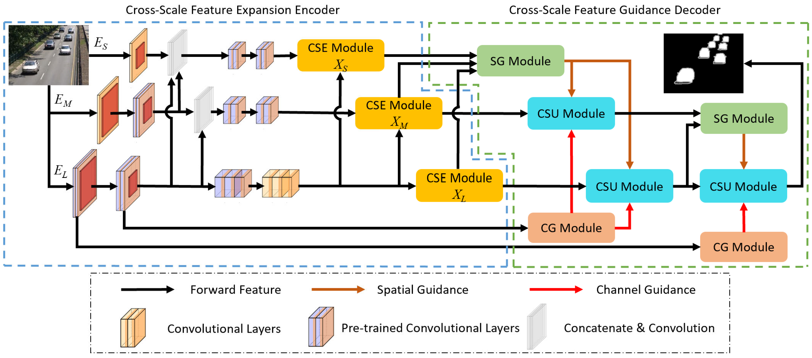
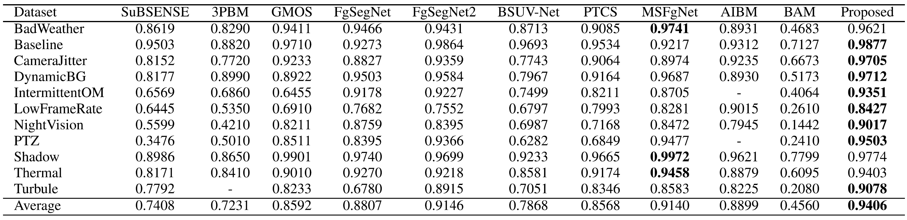
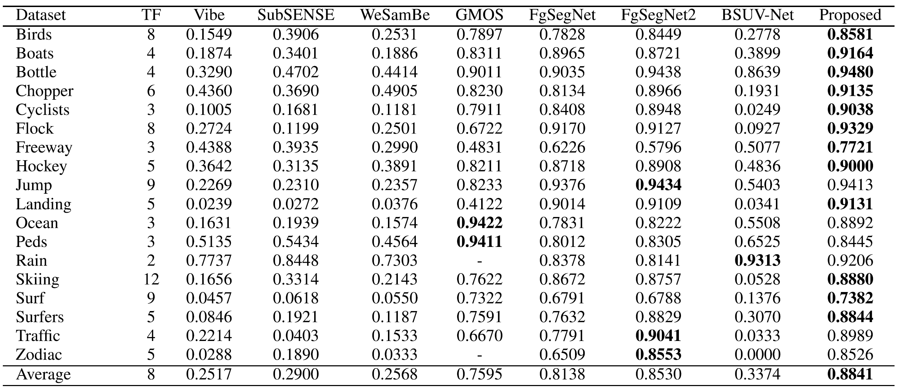
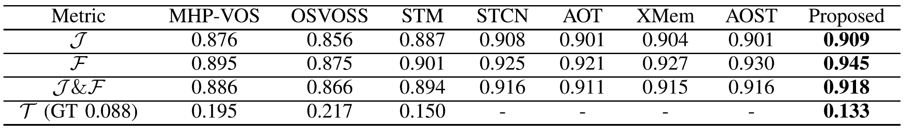

# CSGNet

## Cross-Scale Guidance Network for Few-Shot Moving Foreground Object Segmentation



## Directory structure
Please follow the steps below to properly set up the project directories:
1. Download the [CDnet2014 dataset](http://jacarini.dinf.usherbrooke.ca/dataset2014) and the [UCSD dataset](http://www.svcl.ucsd.edu/projects/background_subtraction/ucsdbgsub_dataset.htm), and place them inside the `datasets` directory.
2. Download the training sets from the following link and place them in the `training_sets` directory:
[Download Training Sets](https://drive.google.com/file/d/1ldfh3bTmxmipzHN-av0rIap0VXbzjwP9/view?usp=drive_link)

The expected directory structure is as follows:
```dataset
CSGNet/
├── datasets
│   ├── CDnet2014_dataset
│   └── UCSD_dataset
├── training_sets
│   ├── CDnet2014_train
│   ├── UCSD_train10
│   ├── UCSD_train20
│   └── UCSD_train50
├── scripts
│   ├── CSGNet_module.py
│   ├── CSGNet_CDnet.py
│   └── ...
└── testing_script
    ├── thresholding.py
    ├── extract_mask_CDnet.py
    └── ...
```

## Requirements
Install the required dependencies:
```setup
pip install -r requirements.txt
```

## Training
To train the proposed model on the CDnet2014 dataset:
```train
python scripts/CSGNet_CDNet.py
```

## Testing
After training, run inference to generate prediction masks and convert prediction probabilities to binary masks:
```test
python testing_scripts\extract_mask_CDNet.py
python testing_scripts\thresholding.py
```

To evaluate the segmentation results:
```eval
> cd testing_scripts\python_metrics
> python processFolder.py <dataset_path> <thresholded_frames_path>
```

## Experimental Results

### CDNet2014


### UCSD


### DAVIS2016


## Reference
Please cite the following paper when you apply the code.

Y.-S. Liao, Y.-W. Lin, Y.-H. Chang and C.-R. Huang, "Cross-Scale Guidance Network for Few-Shot Moving Foreground Object Segmentation," IEEE Transactions on Intelligent Transportation Systems, vol. 26, no. 6, pp. 7726-7739, June 2025, doi: 10.1109/TITS.2025.3559144.

https://ieeexplore.ieee.org/document/10972131
